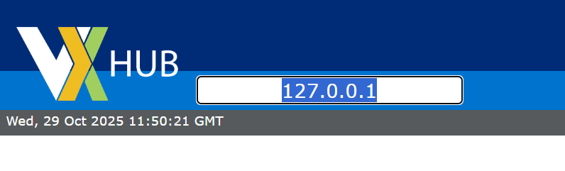
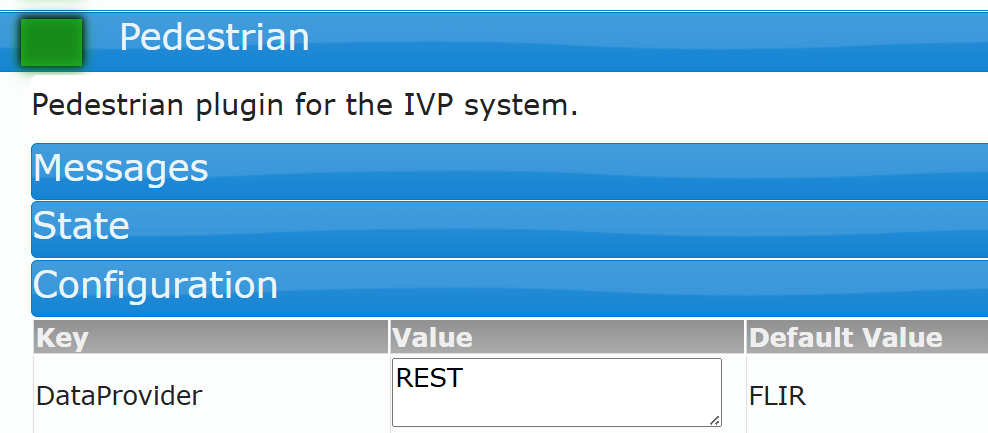
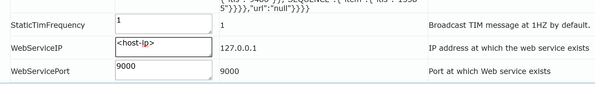

# MQTT to V2X PSM Bridge

Bridge service that converts SceneScape pedestrian detection data to V2X Personal Safety Messages (PSM).

## Overview

This tool subscribes to SceneScape MQTT topics containing pedestrian detection data and automatically converts it to V2X Personal Safety Messages, which are then posted to a V2X Hub API. This enables vehicles to receive real-time alerts about pedestrian locations for enhanced road safety.

## Features

- **Real-time conversion**: Subscribes to SceneScape MQTT streams and processes detections in real-time
- **Multi-region support**: Automatically subscribes to all SceneScape regions
- **ASN.1 compliant**: Proper conversion of all fields to J2735 ASN.1 format
- **Speed calculation**: Computes pedestrian speed from velocity vectors
- **Configurable**: All settings via environment variables

## Requirements

- Python 3.10+
- SceneScape MQTT broker access
- V2X Hub API endpoint

## Installation

```bash
# Install dependencies
pip install -r requirements.txt
```

## Configuration

All configuration is done via environment variables:

### MQTT Configuration

| Variable            | Description                                  | Default                       |
| ------------------- | -------------------------------------------- | ----------------------------- |
| `MQTT_SERVER`       | MQTT broker address                          | `broker.scenescape.intel.com` |
| `MQTT_PORT`         | MQTT broker port                             | `1883`                        |
| `MQTT_USERNAME`     | MQTT username                                | `admin`                       |
| `MQTT_PASSWORD`     | MQTT password                                | _(empty)_                     |
| `MQTT_USE_TLS`      | Enable TLS for MQTT                          | `true`                        |
| `MQTT_TLS_INSECURE` | Skip TLS certificate verification (insecure) | `true`                        |
| `MQTT_CA_CERT`      | Path to CA certificate file for TLS          | _(empty)_                     |

> **Note**: The bridge automatically subscribes to **all regions** using the wildcard topic `scenescape/data/region/+/#`
>
> **Security**:
>
> - Set `MQTT_CA_CERT` to path of your CA certificate for proper TLS verification
> - Set `MQTT_TLS_INSECURE=false` when using a CA certificate
> - Default (`MQTT_TLS_INSECURE=true`) disables certificate verification

### V2X Configuration

| Variable          | Description                   | Default                 |
| ----------------- | ----------------------------- | ----------------------- |
| `V2X_API_URL`     | V2X Hub API endpoint          | `http://localhost:9000` |
| `V2X_API_TIMEOUT` | API request timeout (seconds) | `5`                     |

> **Note**: The default `V2X_API_URL` of `http://localhost:9000` will only work when running directly on the host or with `--network host`. When running in a Docker container on a bridge network, you must set this to the host machine's IP address since V2X Hub runs with `network_mode: host`.

### Logging Configuration

| Variable    | Description                                           | Default |
| ----------- | ----------------------------------------------------- | ------- |
| `LOG_LEVEL` | Logging level (DEBUG, INFO, WARNING, ERROR, CRITICAL) | `INFO`  |

## Usage

### Basic Usage

```bash
# Run with defaults
python mqtt_psm.py
```

### With Custom Configuration

```bash
# Set environment variables
export MQTT_SERVER=broker.scenescape.intel.com
export MQTT_USERNAME=my-user
export MQTT_PASSWORD=my-password
export V2X_API_URL=http://<host-ip>:9000
export LOG_LEVEL=DEBUG

# Run the bridge
python mqtt_psm.py
```

### Using a `.env` File

Create a `.env` file:

```bash
MQTT_SERVER=broker.scenescape.intel.com
MQTT_USERNAME=my-user
MQTT_PASSWORD=my-password
V2X_API_URL=http://<host-ip>:9000
LOG_LEVEL=INFO
```

Run with:

```bash
# Load environment variables
set -a; source .env; set +a

# Run the bridge
python mqtt_psm.py
```

### Docker Usage

Build the image:

```bash
docker build -t scenescape-v2x-bridge .
```

Run with host networking to access both MQTT and V2X Hub via localhost:

```bash
docker run --network <scenescape-network> \
  -e MQTT_SERVER=scenescape \
  -e MQTT_PASSWORD=$SUPASS \
  -e V2X_API_URL=http://<host-ip>:9000 \
  scenescape-v2x-bridge
```

> **Note**: Replace `<scenescape-network>` with your SceneScape Docker network name (e.g. `metro-vision-ai-app-recipe_scenescape`) and `<host-ip>` with your host machine's IP address where V2X Hub is.

Or in docker-compose:

```yaml
services:
  v2x-bridge:
    build: tools/v2x
    networks:
      - scenescape
    environment:
      - MQTT_SERVER=scenescape
      - MQTT_PASSWORD=${SUPASS}
      - V2X_API_URL=http://<host-ip>:9000
```

> **Note**: Since V2X Hub runs with `network_mode: host`, you need to use the host machine's IP address (not `localhost`) for `V2X_API_URL`.

## How It Works

1. **Subscribe**: Connects to MQTT broker and subscribes to `scenescape/data/region/+/#` (all regions)
2. **Filter**: Processes only pedestrian detections from the stream
3. **Transform**: Converts geospatial coordinates to ASN.1 format (microdegrees) and calculates speed
4. **Generate**: Creates V2X PSM XML messages with pedestrian data
5. **Publish**: Posts PSM messages to V2X Hub API

## Data Flow

```
SceneScape Detection
    ↓ (MQTT)
MQTT Broker
    ↓ (subscribe)
PSM Bridge
    ├─ Filter pedestrians
    ├─ Calculate speed
    ├─ Transform coordinates
    └─ Generate PSM XML
    ↓ (HTTP POST)
V2X Hub API
    ↓
V2X Infrastructure
```

## PSM Message Format

The bridge generates Personal Safety Messages following the J2735 standard with proper ASN.1 encoding:

- **Basic Type**: Pedestrian
- **Position**: Latitude, longitude (in 1/10th microdegrees), elevation (in decimeters)
- **Speed**: Calculated from velocity vector, in units of 0.02 m/s
- **Heading**: Direction of movement, in units of 0.0125 degrees
- **Accuracy**: Position accuracy indicators (semiMajor, semiMinor, orientation)
- **ID**: 4-byte hex identifier generated from pedestrian UUID

## Verification

An example setup to run the bridge can be achieved following the steps:

1. Install SceneScape application containing Pedestrian data.

   An example application used is Smart-Intersection. Follow the [installation instructions to get started](https://github.com/open-edge-platform/edge-ai-suites/blob/main/metro-ai-suite/metro-vision-ai-app-recipe/smart-intersection/docs/user-guide/get-started.md).

   > **Note**: Change the webUI port from `443:443` to `<port>:443` in docker-compose file to avoid clashing with V2XHUB.

2. Install V2XHUB

   [Installation instructions](https://github.com/usdot-fhwa-OPS/V2X-Hub/tree/develop/configuration)

3. Access V2XHUB UI and enable Pedestrian Plugin.

   > **Note**: Change the IP address in the UI from localhost to your `<host-ip>`.
   > 

4. Update the Pedestrian plugin configuration.

   Set `DataProvider` as REST. To do this simply update the Configuration field of the Plugin:
   

   Set the `WebServiceIP` to your host-ip. Otherwise the plugin will only listen on localhost.
   

5. Enable the Pedestrian Plugin.

6. The script can now be run as according to the [Usage Section](#basic-usage)

7. The amount of accepted J2735 messages in V2XHUB can be seen in Messages section of the UI.
   The generated XMLs by the plugin can be viewed on the output by using DEBUG logging level.
   Accepted J2735 data by V2XHUB can also be viewed using `JSONMessageLoggerPlugin`.

## Related Documentation

- [SceneScape Documentation](https://github.com/open-edge-platform/scenescape)
- [V2X Hub Documentation](https://github.com/usdot-fhwa-OPS/V2X-Hub)
- [J2735 PSM Standard](https://www.sae.org/standards/j2735_202007-v2x-communications-message-set-dictionary)
